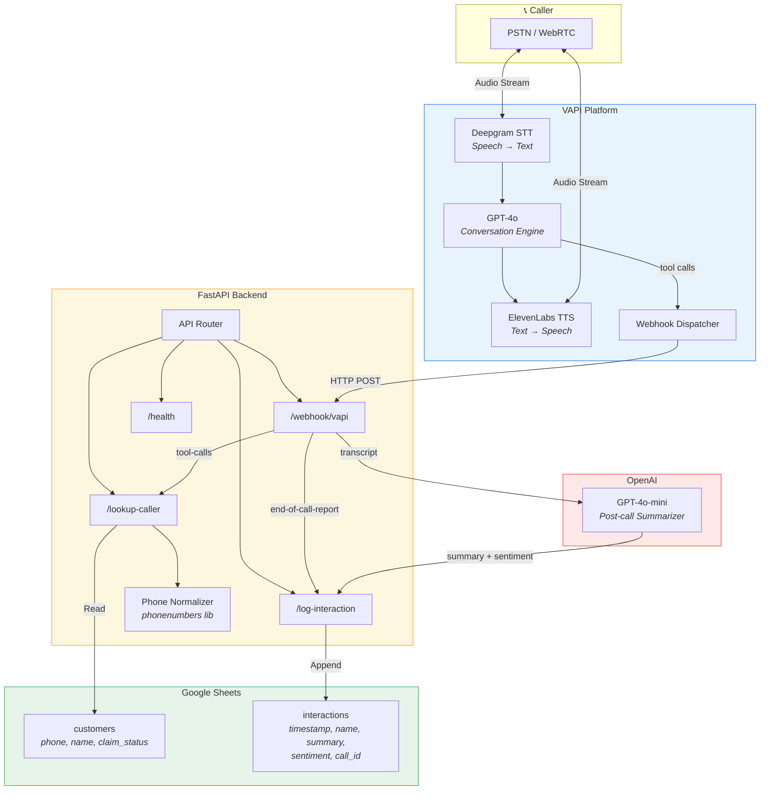
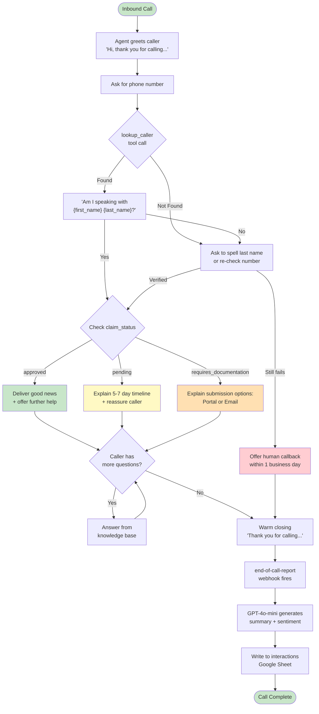
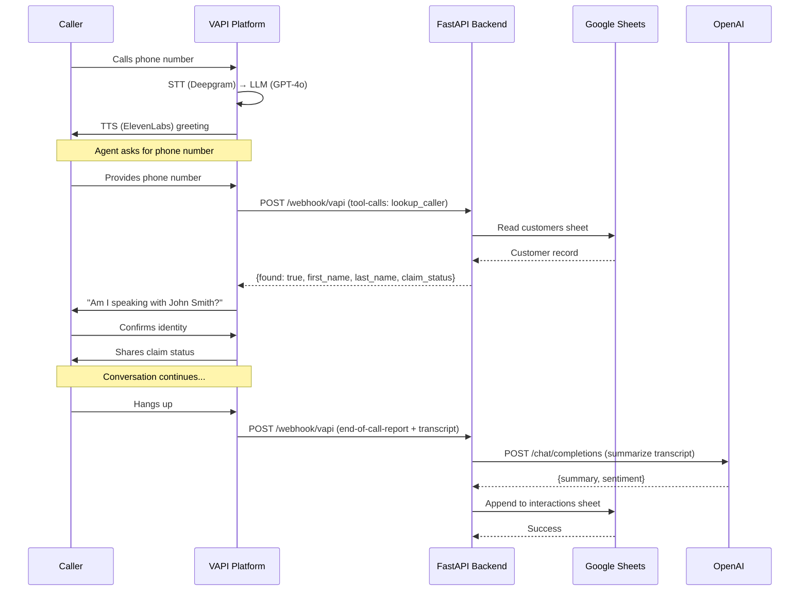

# Solution Architecture

## High-Level Architecture Diagram

```mermaid
flowchart TB
    subgraph Caller["📞 Caller"]
        PSTN["PSTN / WebRTC"]
    end

    subgraph VAPI["VAPI Platform"]
        STT["Deepgram STT<br/><i>Speech → Text</i>"]
        LLM["GPT-4o<br/><i>Conversation Engine</i>"]
        TTS["ElevenLabs TTS<br/><i>Text → Speech</i>"]
        WH["Webhook Dispatcher"]

        STT --> LLM
        LLM --> TTS
        LLM -->|"tool calls"| WH
    end

    subgraph Backend["FastAPI Backend"]
        API["API Router"]
        LOOKUP["/lookup-caller"]
        LOG["/log-interaction"]
        WEBHOOK["/webhook/vapi"]
        HEALTH["/health"]
        NORM["Phone Normalizer<br/><i>phonenumbers lib</i>"]

        API --> LOOKUP
        API --> LOG
        API --> WEBHOOK
        API --> HEALTH
        LOOKUP --> NORM
    end

    subgraph Data["Google Sheets"]
        CUST["customers<br/><i>phone, name, claim_status</i>"]
        INTER["interactions<br/><i>timestamp, name, summary,<br/>sentiment, call_id</i>"]
    end

    subgraph AI["OpenAI"]
        SUMMARY["GPT-4o-mini<br/><i>Post-call Summarizer</i>"]
    end

    PSTN <-->|"Audio Stream"| STT
    TTS <-->|"Audio Stream"| PSTN
    WH -->|"HTTP POST"| WEBHOOK
    WEBHOOK -->|"tool-calls"| LOOKUP
    WEBHOOK -->|"end-of-call-report"| LOG
    LOOKUP -->|"Read"| CUST
    LOG -->|"Append"| INTER
    WEBHOOK -->|"transcript"| SUMMARY
    SUMMARY -->|"summary + sentiment"| LOG

    style VAPI fill:#e8f4fd,stroke:#1a73e8
    style Backend fill:#fef7e0,stroke:#f9ab00
    style Data fill:#e6f4ea,stroke:#34a853
    style AI fill:#fce8e6,stroke:#ea4335
```

## Conversational Flow

```mermaid
flowchart TD
    START([Inbound Call]) --> GREET["Agent greets caller<br/>'Hi, thank you for calling...'"]
    GREET --> ASK_PHONE["Ask for phone number"]
    ASK_PHONE --> LOOKUP{"lookup_caller<br/>tool call"}

    LOOKUP -->|Found| CONFIRM["'Am I speaking with<br/>{first_name} {last_name}?'"]
    LOOKUP -->|Not Found| ALT_VERIFY["Ask to spell last name<br/>or re-check number"]

    CONFIRM -->|Yes| STATUS{"Check claim_status"}
    CONFIRM -->|No| ALT_VERIFY

    ALT_VERIFY -->|Verified| STATUS
    ALT_VERIFY -->|Still fails| CALLBACK["Offer human callback<br/>within 1 business day"]

    STATUS -->|approved| APPROVED["Deliver good news<br/>+ offer further help"]
    STATUS -->|pending| PENDING["Explain 5-7 day timeline<br/>+ reassure caller"]
    STATUS -->|requires_documentation| DOCS["Explain submission options:<br/>Portal or Email"]

    APPROVED --> FAQ{"Caller has<br/>more questions?"}
    PENDING --> FAQ
    DOCS --> FAQ

    FAQ -->|Yes| ANSWER["Answer from<br/>knowledge base"]
    FAQ -->|No| CLOSE
    ANSWER --> FAQ

    CALLBACK --> CLOSE["Warm closing<br/>'Thank you for calling...'"]

    CLOSE --> END_OF_CALL["end-of-call-report<br/>webhook fires"]
    END_OF_CALL --> SUMMARIZE["GPT-4o-mini generates<br/>summary + sentiment"]
    SUMMARIZE --> LOG_SHEET["Write to interactions<br/>Google Sheet"]
    LOG_SHEET --> DONE([Call Complete])

    style START fill:#c8e6c9
    style DONE fill:#c8e6c9
    style CALLBACK fill:#ffcdd2
    style APPROVED fill:#c8e6c9
    style PENDING fill:#fff9c4
    style DOCS fill:#ffe0b2
```

## Webhook Event Flow

```mermaid
sequenceDiagram
    participant C as Caller
    participant V as VAPI Platform
    participant B as FastAPI Backend
    participant S as Google Sheets
    participant O as OpenAI

    C->>V: Calls phone number
    V->>V: STT (Deepgram) → LLM (GPT-4o)
    V->>C: TTS (ElevenLabs) greeting

    Note over V,C: Agent asks for phone number

    C->>V: Provides phone number
    V->>B: POST /webhook/vapi (tool-calls: lookup_caller)
    B->>S: Read customers sheet
    S-->>B: Customer record
    B-->>V: {found: true, first_name, last_name, claim_status}
    V->>C: "Am I speaking with John Smith?"

    C->>V: Confirms identity
    V->>C: Shares claim status

    Note over V,C: Conversation continues...

    C->>V: Hangs up
    V->>B: POST /webhook/vapi (end-of-call-report + transcript)
    B->>O: POST /chat/completions (summarize transcript)
    O-->>B: {summary, sentiment}
    B->>S: Append to interactions sheet
    S-->>B: Success
```
