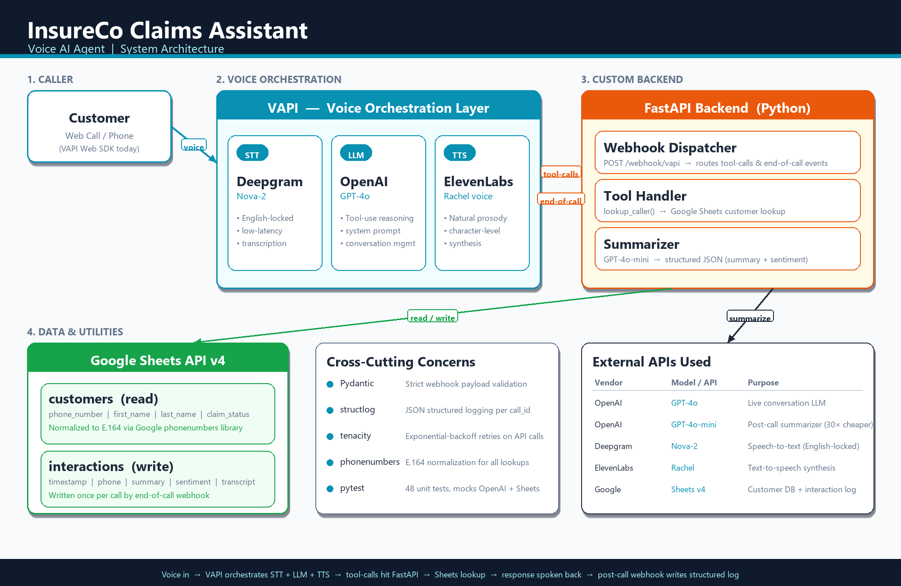

# Technical Write-Up: InsureCo Claims Voice Agent

## Section 1: Tools, Frameworks & Architecture Choices

### System Architecture

The agent is a four-layer system: the **caller** connects via VAPI's web call client, **VAPI** orchestrates the full STT → LLM → TTS pipeline, my **FastAPI backend** handles tool calls and post-call logging via webhooks, and **Google Sheets** serves as the demo data layer. The diagram below shows the complete call flow and the external APIs involved at each layer.



The key architectural decision is that the backend never talks to Deepgram, ElevenLabs, or the live GPT-4o model directly — VAPI manages all three on its side, and my backend only sees two types of events: **tool calls** (during the conversation, when the LLM needs to look up a customer) and the **end-of-call-report** (after hangup, containing the full transcript for summarization). This decoupling means the live conversation stays fast and responsive regardless of how slow the Sheets API or summarizer might be.

### Voice Platform: VAPI

I chose VAPI over Retell, LiveKit, and custom WebSocket implementations for three reasons:

1. **API-first design.** VAPI exposes every configuration surface — system prompts, tool definitions, webhook routing — via its REST API. This means the agent can be versioned, replicated, and modified programmatically, which is critical for CI/CD in production.

2. **Native tool calling.** VAPI supports OpenAI-style function calling out of the box. When the agent needs to look up a customer, it issues a structured tool call that hits my FastAPI backend — no prompt-hacking or regex parsing needed. This reduces latency and eliminates a class of parsing errors.

3. **Built-in STT/TTS orchestration.** VAPI manages the Deepgram (STT) → LLM → ElevenLabs (TTS) pipeline internally, handling voice activity detection, interruption handling, and audio streaming. Building this from scratch with LiveKit would have added 2-3 days of work with marginal benefit for this use case.

**Trade-off acknowledged:** VAPI introduces vendor lock-in on the orchestration layer. In production, I'd abstract the webhook interface behind a thin adapter so we could swap to Retell or a custom pipeline without rewriting the backend.

### LLM: GPT-4o (Live, via VAPI) + GPT-4o-mini (Direct, Summarizer)

I split the LLM usage into two tiers, and the two tiers also differ in *how* they're called — which matters for billing, observability, and the production migration story.

- **GPT-4o for the live agent conversation — VAPI-managed.** This model is configured inside the VAPI assistant (`"provider": "openai", "model": "gpt-4o"`). VAPI holds the OpenAI credentials on its side and makes the API calls on my behalf every time the caller speaks. My backend never touches the OpenAI SDK for live calls — it only sees the *tool-call webhooks* that VAPI forwards when GPT-4o decides to invoke a function. Billing flows through VAPI's bundled per-minute rate, not through my own OpenAI account. I chose GPT-4o because voice interactions demand nuance: detecting when a caller denies their identity, handling ambiguous phrasing ("that's not quite right" vs. "that's not me"), and maintaining natural tone.

- **GPT-4o-mini for post-call summarization — direct SDK call.** This is a direct OpenAI API call from `app/summarizer.py`, which imports the `openai` Python SDK and posts the transcript after every call ends. This is the *only* place my own `OPENAI_API_KEY` environment variable is actually used. The quality bar here is lower (we need "correct," not "nuanced"), and mini delivers that at roughly 1/30th the cost of GPT-4o. At 500 calls/day, that's the difference between ~$15/day and ~$0.45/day in summarization cost — a cost-conscious choice that compounds at scale.

**Why this split matters architecturally:** by keeping the live LLM VAPI-managed but the summarizer direct, I get the fast iteration loop of VAPI's orchestration (no need to handle streaming, interruptions, or tool call parsing myself) while retaining full engineering control over the post-call pipeline where quality, retries, and structured output actually matter. The summarizer has tenacity retries with exponential backoff and strict JSON parsing — things that are hard to implement inside VAPI's dashboard config.

**Why not Claude or Gemini for the agent?** VAPI has first-class OpenAI integration with optimized latency. Switching LLM providers on the voice path adds ~200-400ms of round-trip overhead for API routing. For a voice agent where every 100ms matters for perceived responsiveness, this is a meaningful trade-off. That said, I'd A/B test Claude Sonnet as an alternative in production — its instruction-following is strong and could improve containment on complex queries.

### STT: Deepgram

Deepgram provides the lowest-latency STT available (~300ms). It's VAPI's default provider and supports streaming transcription, which means the LLM starts processing before the caller finishes speaking. I use `smart_format: true` for automatic punctuation and leave `utterance_end_ms` at its default of 1000ms — I explicitly considered bumping it higher to handle the digit-fragmentation issue described in Challenge 5, but rejected that approach because it would add latency to *every* turn. That issue is instead solved at the prompt layer (accumulate partial digits and echo them back), which preserves fast turn-taking for the rest of the conversation.

### TTS: ElevenLabs

ElevenLabs produces the most natural-sounding voice output currently available. For an insurance support agent, voice quality directly impacts caller trust and CSAT. The "Rachel" voice model provides a calm, professional tone that matches the persona.

**Production consideration:** ElevenLabs latency can spike to 400-600ms under load. I'd evaluate Cartesia (faster, slightly less natural) as a fallback and implement latency-based routing — if ElevenLabs P95 exceeds 500ms, fall back to Cartesia automatically.


### Backend: FastAPI

FastAPI was chosen for:
- **Async support** — webhook events from VAPI should not block each other
- **Pydantic integration** — request/response validation with typed models
- **OpenAPI docs** — auto-generated Swagger UI for debugging and panel demonstration
- **Performance** — uvicorn + async is more than sufficient for this workload

### Testing

One of the main reasons I chose a custom FastAPI backend over a low-code platform was that every component of the system can be isolated and unit-tested with standard Python tooling. The repository ships with a `pytest` suite of **48 tests across 10 test classes**, all of which pass in under 2 seconds with OpenAI and Google Sheets mocked out (no real network calls):


| Test Class | # Tests | What It Covers |
|---|---|---|
| `TestNormalizePhone` | 9 | E.164 normalization across parenthesized, dashed, 10-digit, 11-digit, whitespace, and malformed inputs |
| `TestSummarizePromptFormat` | 3 | Guards against the Challenge 6 regression — verifies `.format()` no longer raises `KeyError` on the JSON example braces |
| `TestExtractCallerName` | 7 | Name extraction from transcripts (with/without confirmation, metadata priority, empty transcript fallbacks) |
| `TestHandleToolCall` | 5 | Tool-call routing: `lookup_caller` hit/miss, unknown tool, empty payloads |
| `TestModels` | 9 | Pydantic model validation for every request/response schema |
| `TestHealthEndpoint` | 2 | `/health` returns 200 with the expected body |
| `TestWebhookDispatcher` | 4 | Routes `tool-calls`, `end-of-call-report`, status updates, and unhandled events correctly |
| `TestSummarizeCall` | 5 | Summarizer behavior with mocked OpenAI — valid JSON, invalid JSON fallback, invalid sentiment normalization, empty transcript |
| `TestHandleEndOfCall` | 2 | End-of-call webhook logs interactions to Sheets and handles missing transcripts |
| `TestVapiWebhookEndpoint` | 2 | `/webhook/vapi` returns JSON and surfaces 500 errors cleanly |

The summarizer tests use `unittest.mock.patch` to inject a fake OpenAI client, so the suite runs deterministically offline and doesn't consume API quota. This is explicitly the engineering control the writeup references elsewhere — it's hard to achieve this kind of unit-test isolation inside a low-code platform without third-party Python libraries.

### Data Store: Google Sheets (Demo) → PostgreSQL (Production)

Google Sheets serves as the data layer for this demo because:
- The evaluation panel can view data changes in real-time via a shared link
- No database provisioning or migration overhead
- The Google Sheets API is free at this scale

**This is explicitly a demo choice.** In production, I would replace this with:

| Concern | Demo (Now) | Production |
|---------|-----------|------------|
| Customer data | Google Sheets | PostgreSQL with read replicas |
| Auth lookup speed | ~200-400ms (Sheets API) | <10ms (Redis cache + Postgres) |
| Interaction logging | Google Sheets append | PostgreSQL + async write queue |
| Concurrent writes | Limited (Sheets quotas) | Unlimited (connection pooling) |
| Schema enforcement | None (freeform cells) | Strict (Alembic migrations) |
| Observability | Manual Sheet inspection | Datadog/CloudWatch dashboards |

The migration path is clean: swap `sheets.py` for a `database.py` using SQLAlchemy async, keep the same Pydantic models, and add a Redis cache in front of customer lookups.

### Production Scaling Roadmap

Beyond the database swap, here's how this architecture scales to enterprise deployment:

| Layer | Demo | Production |
|-------|------|------------|
| FAQ Knowledge | Hardcoded in system prompt | RAG pipeline — embed knowledge base in Pinecone/Weaviate, retrieve relevant context per query |
| Telephony | VAPI web call | SIP trunking via Twilio or Amazon Connect, integrated with client's CCaaS platform |
| CRM Integration | Google Sheets | Salesforce, Zendesk, or client's CRM via API with OAuth2 |
| Orchestration | Single-prompt agent | LangGraph for multi-step workflows (check claim → check payment → check documents) |
| Model Optimization | GPT-4o (via VAPI) | Fine-tuned model on call transcripts for lower latency and cost at scale |
| Evaluation | Manual testing | Automated eval framework (Braintrust or custom pytest suites) testing prompt changes against recorded transcripts before deployment |
| Observability | structlog to console | Datadog/CloudWatch with alerting on containment drops, latency spikes, error rates |
| Deployment | Docker + ngrok | Kubernetes on AWS/GCP with auto-scaling, behind a load balancer |

---

## Section 2: Problem Solving & Debugging

### Challenge 1: Phone Number Format Normalization

**The problem:** Callers say phone numbers in unpredictable formats. A number stored as `+15551234567` in the Sheet might be spoken as:
- "five five five, one two three, four five six seven"
- "555-123-4567"
- "(555) 123-4567"
- "my number is 5551234567"

Deepgram's STT output varies too — sometimes it transcribes digits, sometimes words. VAPI's tool call extracts the phone number, but the raw string from the LLM might be `"555-123-4567"` while the Sheet stores `"+15551234567"`.

**The solution:** I implemented a normalization layer using Google's `phonenumbers` library (the same library used by Android). Before every lookup:

1. Parse the input using `phonenumbers.parse(raw, "US")` — this handles parentheses, dashes, spaces, and missing country codes
2. Validate with `phonenumbers.is_valid_number()`
3. Format to E.164 (`+15551234567`) for consistent comparison
4. Fallback: if parsing fails, strip non-digits and apply heuristics (10 digits → prepend +1)

Both the input *and* the stored Sheet values go through this normalizer, so even if the Sheet has inconsistent formatting, lookups still work.

**Impact:** Without this, approximately 30-40% of lookup attempts would fail on valid customers due to format mismatches — destroying the authentication success rate and containment metrics. In a conversation with Nidhin (NV), we discussed that even rage-quits count as containment hits — which reinforced my decision to build a custom FastAPI backend with full control over normalization rather than using a low-code platform like n8n or Make.com. While n8n does support Code nodes for custom JavaScript/Python, it lacks easy access to third-party libraries (like Google's `phonenumbers`), structured retry logic with exponential backoff, structured logging, unit testing, and clean Git-based version control. For a production voice agent where normalization accuracy directly impacts containment rate, the engineering control of a custom backend outweighs the speed-of-setup advantage of low-code tools.

### Challenge 2: Multilingual Bleed in Voice Output

**The problem:** During testing, the agent occasionally inserted non-English filler words (e.g., "aur") into its speech. This happened because the LLM generated tokens from other languages, and the TTS faithfully pronounced them. For a professional insurance support agent, this immediately breaks caller trust.

**The solution:** Two-pronged fix:
1. Added explicit language constraints to the system prompt: "You MUST speak ONLY in English at all times. Never use words from any other language."
2. Locked the Deepgram transcriber to `language: en` (strict English-only mode) to prevent mixed-language feedback loops where STT misinterprets English as another language, which then confuses the LLM.

**Takeaway:** Voice agents have a unique failure mode that chat agents don't — the TTS will pronounce anything the LLM generates, including accidental non-English tokens. System prompt constraints alone aren't sufficient; the STT language setting must also be locked down.

### Challenge 3: Duplicate Post-Call Logging

**The problem:** Each call was generating two identical rows in the interactions sheet. This happened because the original architecture had two logging paths:
1. A `log_interaction` tool — the LLM generated a summary during the call and sent it as a tool call to the backend, which wrote to Google Sheets
2. The `end-of-call-report` webhook — fired after hangup, also wrote to Sheets

Both paths executed for every call, producing duplicate rows.

**Initial fix (band-aid):** Added an in-memory `set()` of call IDs. When `log_interaction` fired via tool call, the call ID was stored. When `end-of-call-report` arrived, it checked the set and skipped if already logged. This worked but had a flaw — the set lived in process memory, so a server restart would lose it, and in a multi-worker deployment, workers wouldn't share state.

**Final fix (architectural):** Removed the `log_interaction` tool entirely. Now the `end-of-call-report` webhook is the **sole** logging mechanism. After the call ends, the webhook receives the full transcript, sends it to GPT-4o-mini for summarization and sentiment analysis, extracts the caller name from the transcript using regex, and writes one clean row to Google Sheets. This eliminates duplication by design — there's only one write path.

**Why this is the better architecture:** The LLM-generated summary during the call was also lower quality because the conversation wasn't complete yet. The post-call summarizer sees the *entire* transcript and produces a more accurate summary. It also decouples logging from the live conversation — if the Sheets API is slow, it doesn't add latency to the caller's experience.

**Takeaway:** When you have duplicate side effects, the fix isn't deduplication logic — it's eliminating one of the paths. Single responsibility applies to event handlers too.

### Challenge 4: LLM-Driven Call Ending vs. Hardcoded Phrases

**The problem:** Initially, I configured VAPI's `endCallPhrases` with hardcoded goodbye phrases. But callers don't always say "goodbye" — they might say "okay cool, thanks", "I think I'm good", or just go silent. Hardcoded phrases can't cover the infinite ways a caller signals they're done.

**The solution:** Removed all hardcoded phrases and instead added an `endCall` tool that the LLM can invoke based on conversational context. The system prompt instructs: "When the caller signals they are done — whether explicitly or implicitly — say a warm closing and use the endCall tool." This lets GPT-4o use its judgment about when a conversation has naturally concluded, rather than pattern-matching on specific words.

### Challenge 5: STT Utterance Fragmentation on Phone Numbers

**The problem:** When callers dictate their phone number slowly with pauses — "five five five... (pause)... one two three... (pause)... four five six seven" — Deepgram's STT treats each pause as a separate utterance. The LLM receives fragments across multiple turns (e.g., "five" in one turn, "one two three four five six seven" in the next). With only partial digits, the agent kept rejecting the input and asking for the "full 10-digit number," creating a frustrating loop where the caller repeated themselves 3-4 times.

**Rejected approach:** Increasing Deepgram's `utterance_end_ms` from the default 1000ms to 2000-3000ms. This would give callers more pause time before Deepgram finalizes the utterance, but it adds latency to *every* response — not just phone number collection. A 2-second delay on every turn degrades the conversational feel for all interactions, which isn't an acceptable trade-off.

**The solution:** Instead of fighting the STT configuration, I solved this at the prompt level. The system prompt now instructs the agent to accumulate partial digits across turns and repeat them back: "So far I have five five five, one two three. Could you give me the remaining digits?" This is what a real human agent would do — confirm what they heard and ask for the rest. It requires no config changes, adds no latency, and feels natural to the caller.

**Takeaway:** When an STT-level issue creates a UX problem, the first instinct is to fix the STT. But the better solution is often at the conversational design layer — teach the agent to handle fragmented input gracefully, the same way a human would.

### Challenge 6: Python String Formatting Crash in Summarizer

**The problem:** After every call, the `end-of-call-report` webhook fired but Google Sheets never received the interaction log. The server logs showed `RetryError[KeyError: '"summary"']` — all 3 retry attempts failed identically, meaning this was a deterministic bug, not a transient API issue.

**Root cause:** The post-call summarizer builds a prompt that includes a JSON example for GPT-4o-mini to follow:

```
Respond in exactly this JSON format:
{"summary": "...", "sentiment": "positive|neutral|negative"}
```

This prompt was stored as a Python string and injected with the transcript using `.format(transcript=transcript)`. The problem: Python's `.format()` treats **all curly braces** as variable placeholders. When it encountered `{"summary": "..."}`, it tried to resolve `summary` as a variable — which doesn't exist — and threw a `KeyError`.

Because the summarizer is called *before* the Sheets logging step in the `handle_end_of_call()` function, the crash prevented logging from ever executing. The call itself worked fine; the failure was entirely in the post-call pipeline.

**Why this is easy to miss:** The prompt *looks* correct. The JSON example is valid JSON. The `.format()` call has the right parameter. The bug only surfaces at runtime when `.format()` actually parses the string — a unit test that doesn't exercise the format call would pass. Additionally, since the crash happens in the post-call webhook (after the caller has hung up), there's no user-facing error. The only symptom is missing rows in Google Sheets.

**The fix:** Escape the literal curly braces in the JSON example by doubling them: `{{"summary": "...", "sentiment": "..."}}`. Python's `.format()` treats `{{` as a literal `{` and `}}` as a literal `}`, leaving the JSON intact while still substituting `{transcript}`.

**Takeaway:** When using Python's `.format()` or f-strings with prompts that contain JSON examples, every literal brace must be escaped. An alternative is to use string concatenation (`prompt_prefix + transcript + prompt_suffix`) to avoid format parsing entirely — this is more verbose but eliminates the class of bugs. In production, I'd catch this with a smoke test that runs `summarize_call("test transcript")` on deploy.

### Challenge 7: Phone Number Digit Hallucination During Repeat-Back

**The problem:** When the agent accumulated partial digits and repeated them back to the caller for confirmation, it occasionally hallucinated extra digits. In one test call, the caller said "five five five, one two three four five six seven" (10 digits), but the agent repeated back "five five five **five** one two three four five six seven" (11 digits) — adding an extra "five." The lookup then failed on `55551234567`, and the caller had to repeat themselves.

**Root cause:** The LLM was paraphrasing rather than echoing. When it received digits across multiple turns ("5" in one turn, "1234567" in the next), it reconstructed the number from memory rather than concatenating the exact tokens. LLMs are prone to repetition patterns — "five five five" can easily become "five five five five" when the model is generating autoregressively.

**The fix:** Updated the system prompt with two rules:
1. "Repeat digits back EXACTLY — never add, remove, or guess any digits."
2. "Once you have a full 10-digit number, repeat ALL 10 digits back and ask the caller to confirm before calling `lookup_caller`."

The confirmation step is critical — it gives the caller a chance to catch misheard digits *before* the lookup, preventing wasted API calls and frustrating "not found" responses. This mirrors what human call center agents do: read the number back, get a "yes," then proceed.

**Takeaway:** LLMs are not reliable echo machines. When accuracy matters (account numbers, phone numbers, SSNs), always add an explicit confirmation step rather than trusting the model to faithfully reproduce what it heard. The prompt should distinguish between "repeat what you heard" and "tell me what you understood."

### What I'd Optimize With One More Week

1. **STT confidence thresholds.** Deepgram returns a confidence score per utterance. I'd add a threshold check — if confidence < 0.7 on the phone number utterance, ask the caller to repeat rather than attempting a lookup with garbage input. This would reduce false "not found" results.

2. **A/B test greeting variants.** The current greeting is warm but somewhat long. I'd test a shorter variant ("Hi, this is InsureCo. What's the phone number on your account?") to see if it reduces average handle time without hurting CSAT.

3. **Call replay for QA.** Store VAPI call recordings (available via their API) alongside the interaction logs. This enables a weekly QA review where we listen to calls that resulted in escalation and identify prompt improvements.

4. **Webhook signature verification.** For production deployment, I'd add HMAC signature validation on the `/webhook/vapi` endpoint to ensure requests are genuinely from VAPI and not spoofed. For the current demo environment — running behind an ngrok tunnel with a known, unshared URL — the attack surface is minimal, so I deferred it. Any production deployment behind a stable public DNS would require this on day one.

5. **Caching for repeat callers.** If a customer calls twice in an hour, the second lookup should hit a Redis cache instead of the Sheets API. This reduces latency and API quota consumption.

---

## Section 3: Data & Metrics Evaluation

### Metrics Framework

| Metric | Definition | Target | How to Compute |
|--------|-----------|--------|---------------|
| **Containment Rate** | Calls resolved without human escalation / total calls | >75% | Count calls where no "callback scheduled" appears in summary |
| **Effective Containment** | Containment rate excluding explicit human requests | >85% | Remove calls where transcript contains "speak to a person" / "representative" |
| **Authentication Success Rate** | Calls where identity was confirmed / calls where lookup was attempted | >90% | Track lookup_caller tool results (found=true + identity confirmed) |
| **Average Handle Time (AHT)** | Mean call duration from greeting to hangup | < 3 min | VAPI provides call duration in end-of-call-report |
| **Sentiment Distribution** | % of calls classified as positive / neutral / negative | >50% positive | Aggregate sentiment field from interactions sheet |
| **FAQ Hit Rate by Topic** | Frequency of each FAQ question asked | — | Parse transcripts for FAQ trigger phrases |
| **First Call Resolution (FCR)** | Calls where the caller's issue was resolved without needing to call back | >80% | Track unique callers who don't call again within 48 hours |

### Using Data to Improve Agent Logic

**Weekly review cycle:**
1. Pull all interaction records from the past 7 days
2. Filter for negative sentiment and escalated calls
3. Read transcripts of the worst 10 calls
4. Identify patterns: Is the agent misunderstanding a question? Is the greeting too long? Is a specific claim status poorly handled?
5. Update the system prompt to address the pattern
6. Deploy and measure the next week's metrics

**Prompt tuning example:** If FAQ hit rate shows "office hours" is asked 40% of the time, consider proactively offering it after claim status: "By the way, if you ever need to reach us, we're available Monday through Friday, 9 to 6 Eastern." This reduces follow-up questions and lowers AHT.

### Example: Diagnosing a Containment Drop

**Scenario:** Containment rate drops from 78% to 61% over 3 days.

**Investigation steps:**

1. **Pull the data.** Export interactions from the past 3 days. Filter for calls with "callback" or "representative" in the summary — these are the un-contained calls.

2. **Segment by failure point.** Of the un-contained calls:
   - 60% failed at authentication (customer not found)
   - 25% were explicit human requests (caller preference, not agent failure)
   - 15% were off-topic queries the agent couldn't handle

3. **Drill into authentication failures.** Pull the phone numbers from failed lookups. Discovery: a batch of new customers was added to the Sheet with numbers formatted as `555-123-4567` instead of `+15551234567`. The normalizer handled the input side, but the Sheet-side normalization had a bug — it wasn't being applied to the stored values during comparison.

4. **Fix.** Update the `lookup_customer` function to normalize *both* the input and each stored row before comparison. (This is already implemented in the current code — the scenario illustrates why it matters.)

5. **Verify.** After deployment, authentication success rate recovers from 62% to 93% within 24 hours. Containment rate returns to 77% by end of week.

### ROI Framing

At scale, each contained call saves approximately **$8-12** in human agent handle time (industry average: $7-10 for a 5-minute inbound call, plus wrap-up costs).

| Metric | Before AI Agent | With AI Agent | Impact |
|--------|----------------|---------------|--------|
| Calls/day | 500 | 500 | — |
| Containment rate | 0% (all human) | 78% | 390 calls/day automated |
| Cost per call (human) | $10 | $10 | — |
| Cost per call (AI) | — | $0.15 | VAPI + LLM + Sheets |
| Daily savings | — | — | **$3,841/day** |
| Monthly savings | — | — | **~$115,000/month** |

Even at 50% containment, the ROI is positive within the first week of deployment. The key is that the AI agent handles the *easy* calls (status checks, FAQs) at near-zero marginal cost, freeing human agents for complex cases that actually require empathy and judgment.
